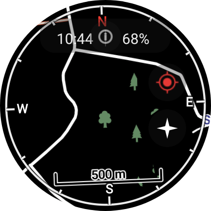

This simple Wear OS app allows doing two things:
* Downloading OSM maps of the whole world for offline use.
* Importing GPX files into the watch, and displaying them on the map so you can follow them.

This app is intended for hiking, trail running and other outdoor sports, so it has the following options:
* Disabling touch input, to use in the rain or if a piece of clothing covers the screen (this also stops the screen from dimming while locked).
* A compass ring with track-up / north-up modes, using the watch's rotation sensor.
* Displaying progress along an active GPX track.

## Installing the app

There are two ways to get the app onto your watch: sideloading over ADB, or using the Wear Installer 2 phone app if you don't have ADB set up.

### Option A: Sideload with ADB

* Download the `offlinemaps.apk` file found in this repository.
* With your watch reachable over ADB (USB or WiFi debugging), run `adb install offlinemaps.apk`.
* Run the app on your watch and grant the GPS permission when prompted.

### Option B: Install with Wear Installer 2 (no computer needed)

[Wear Installer 2](https://play.google.com/store/apps/details?id=org.freepoc.wearinstaller2) is a phone app that sideloads APKs onto a Wear OS watch over WiFi, without needing a PC or USB cable. Full tutorial:

1. **Install Wear Installer 2 on your phone** from the Play Store link above. Your watch needs its companion app (Galaxy Wearable, Wear OS by Google, etc.) already paired with your phone as normal.
2. **Enable Developer Options on the watch**: on the watch, go to *Settings > About* and tap "Software version" (or "Build number") repeatedly until it says Developer Options are enabled.
3. **Enable debugging on the watch**: go to *Settings > Developer options* and turn on:
   * **ADB debugging**
   * **Debug over WiFi** (sometimes called "Wireless debugging")
4. **Connect phone and watch to the same WiFi network** — this is required, Bluetooth alone is not enough for the install step.
5. **Note the watch's IP address**: still in *Developer options*, the WiFi debugging entry usually shows the watch's IP and port (e.g. `192.168.1.42:5555`). If it isn't shown, check *Settings > Connectivity > WiFi* for the IP.
6. **Pair the watch in Wear Installer 2**: open the app on your phone, tap to add/connect a device, and either let it auto-discover the watch on the network or enter the IP address (and port, if asked) manually.
7. **Accept the ADB authorization prompt**: the first time you connect, the watch will show a popup asking to allow debugging from your computer/phone's RSA key — tap **Allow** (and check "always allow" so you don't have to repeat this every time).
8. **Install the APK**: in Wear Installer 2, choose "Install APK", pick the downloaded `offlinemaps.apk` file, and confirm. Progress is shown in the app.
9. **Find the app on the watch**: once it finishes, open the app drawer on the watch — the offline maps app will be listed like any other installed app.

**Troubleshooting:**
* *"Connection refused" / can't find the watch* — double check phone and watch are on the same WiFi network (not one on WiFi and one on mobile data/hotspot), and that "Debug over WiFi" is still toggled on (it can turn itself off after a reboot).
* *Install hangs or fails* — toggle "Debug over WiFi" off and on again on the watch to force it to re-advertise its address, then reconnect in Wear Installer 2.
* *No authorization prompt appears* — go to *Developer options > Revoke USB/wireless debugging authorizations* on the watch, then reconnect so it prompts again.

## Using the app

* Tap and hold the screen to enter the menu, then download a map of your area (placing the watch on a charger may help with slow download speed). The map menu has a quick shortcut for the United Kingdom at the top, in addition to browsing by continent/country.
* When the map is downloaded and location is acquired, you'll see the map drawn on screen. Swipe to scroll, and use rotation input (physical bezel, touch bezel, or crown) to zoom in and out.
* Import a GPX track either by:
  * Entering it from ridewithgps.com or pastebin.com. For the moment there is no authorization, so your saved tracks need to be public. You'll need to enter the 8-digit ID from the URL when importing from RideWithGPS, or the last 8 letters of the paste URL for Pastebin.
  * Sharing a `.gpx` file straight from your phone using the **TrailMap Companion** app — see below.
* Click on a track name to activate it; it will then be shown on the map.
* Use the compass button on the right to switch between **track-up** (the ring rotates so your direction of travel is always "up") and **north-up** (north stays fixed at the top, and a red pointer shows your current heading) modes.
* Click the "location" icon on the right to stop the map from centering on your location.
* Click the "info" icon at the top to toggle the information overlay (clock, battery and track progress).
* Press the back button to lock/unlock touch input (a "lock" icon appears when touch is disabled). Locking touch input also keeps the screen from dimming, so you can leave it locked during navigation without the screen turning off.

## Sending GPX tracks from your phone (TrailMap Companion)

This fork includes a small **TrailMap Companion** phone app (in the `mobile` module of this project) that lets you send a GPX track straight from your phone's normal Android "Share" menu, instead of hunting down a public RideWithGPS/Pastebin link. It works over the same phone↔watch Bluetooth/WiFi link used for pairing — no internet upload, no computer, no ADB required for this part.

**How it works under the hood:** the companion app registers as a Share target for GPX-like files, and when you share a file to it, it streams the file directly to the watch app using the Wear OS Data Layer (`ChannelClient`) API. A listener service on the watch receives the bytes, saves them as a `.gpx` file next to your other tracks, and refreshes the track list automatically. Because this uses the Data Layer's app-to-app channel, the companion app must be built with the **same package name and signing key** as the watch app (already true if you build both from this repository with default debug signing) — you can't mix a companion app from one signer with a watch app from another.

**Setup:**
1. Download `trailmap-companion.apk` found in this repository — this is a separate app from `offlinemaps.apk`, meant to be installed on your **phone**, not the watch. (To rebuild it yourself instead: `./gradlew :mobile:assembleDebug`.)
2. Install it on your phone, e.g. via `adb install trailmap-companion.apk` or by copying it to the phone and opening it (allow installs from unknown sources if prompted).
3. Make sure your phone and watch are already paired as normal (Wear OS by Google / Galaxy Wearable, etc.) — no extra pairing step is needed for this app, it reuses that existing connection.

Note: if you update `offlinemaps.apk` on the watch, make sure `trailmap-companion.apk` on your phone was built at the same time from this repository — both must share the same package name and signing key for the two apps to talk to each other.

**Sending a track:**
1. From any app on your phone (Files, Google Drive, email, a browser download, etc.), use **Share** on a `.gpx` file.
2. Choose **TrailMap Companion** from the share sheet.
3. The app sends the file to your watch and shows "Sent \<filename\> to \<watch name\>" when done.
4. On the watch, the track appears in the track list immediately (or the next time you open the tracks menu) — no need to reopen the app.

**Troubleshooting:**
* *No paired watch found* — open TrailMap Companion directly (not via Share) to see its connection status; make sure the watch is nearby and connected to your phone as usual.
* *"Failed to send file"* — the watch app must be installed for the listener service to exist; try reopening the watch app once after installing it, then share again.
* *Track doesn't show up* — confirm the file actually has GPX content; some file managers share generic `application/octet-stream` files that aren't valid GPX, which will fail to parse on the watch.

## What I've changed in this fork

This is a fork of the original [offlinemaps](https://github.com/miki151/offlinemaps) project by miki151. On top of the original app, this fork adds:

* **Compass ring overlay** (`CompassRingView`) — a ring drawn around the edge of the map with N/E/S/W tick marks, driven by the watch's rotation vector sensor.
* **Track-up / north-up toggle** — a new orientation button next to the location button lets you switch between the ring rotating with your heading (track-up) or staying fixed with a heading pointer (north-up).
* **Redesigned on-screen controls** — the location and compass buttons are now grouped in a circular-button stack on the right edge, the clock/battery overlay sits in a pill-shaped background, and the touch-lock indicator uses the same circular badge style, for a cleaner, more legible HUD.
* **Merged screen-dimming control into touch lock** — the old standalone "sun" button was removed; locking touch input now automatically keeps the screen on, and unlocking lets it dim again, which is one less thing to manage mid-hike.
* **Quick United Kingdom map shortcut** — the map download menu now shows a "United Kingdom" entry with live download status at the top level, instead of needing to dig into the Europe category.
* **New adaptive app icon** — replaced the old fixed raster launcher icons with a modern adaptive icon (separate foreground/background layers).
* **TrailMap Companion phone app** — a new `mobile` module that lets you share a GPX file straight from your phone to the watch over the Wear OS Data Layer, instead of only importing by RideWithGPS/Pastebin URL. See "Sending GPX tracks from your phone" above.

This app was made thanks to the awesome Mapsforge library: https://github.com/mapsforge/mapsforge
